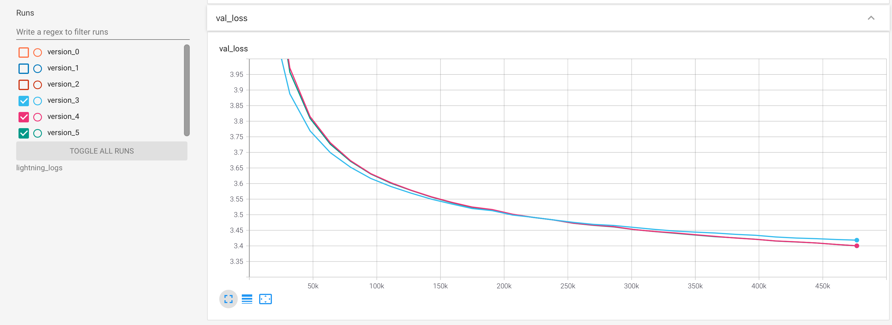

# GPT-2 Japanese model for HuggingFace's transformers

This repository summarizes how the GPT-2 model of HuggingFace's transformers library is trained on Japanese Wikipedia.
This repository currently contains codes only for small size model.

## Training

Create a new directory to train models.

```sh
$ mkdir -p experiment/small/v2/
$ cp get_jawiki.sh experiment/small/v2
$ cd experiment/small/v2/
```

### Clone training script

```sh
$ git clone https://github.com/colorfulscoop/convmodel
$ cd convmodel/examples/language_modeling/
$ git checkout e410b3
```

### Prepare data

```sh
$ docker container run -w /work -v $(pwd):/work --rm -it python:3.8.6-slim-buster bash
(container)$ apt update && apt install -y wget git
```

Check the latest date in the list from https://dumps.wikimedia.org/jawiki/ .
`20210301` is the latest as of March 15th, 2021.

```sh
(container)$ bash get_jawiki.sh 20210301
```

Finally generated data can be found under `data` directory.

```sh
(container)$ ls data/jawiki/20210301/data/
test.txt  train.txt  valid.txt
```

```sh
(container)$ exit
```

### Train tokenizer

Note: tokenizer was trained only in v1. After v2, the same tokenizer model is used to ensure to keep same tokens.

Train SentencePiece model.

```sh
$ docker container run -w /work -v $(pwd):/work --rm -it python:3.8.6-slim-buster bash
(container)$ pip install -r requirements.txt
(container)$ python train_tokenizer.py --train_file data/jawiki/20210301/data/train.txt
(container)$ exit
```

### Train model


Install PyTorch with CUDA 11.1 and dependent packages.

```sh
$ docker container run --gpus all --ipc=host --rm -it -v $(pwd):/work -w /work nvidia/cuda:11.1-devel-ubuntu20.04 bash
(container)$ apt update && apt install -y python3 python3-pip git
(container)$ pip3 install torch==1.8.1+cu111 -f https://download.pytorch.org/whl/torch_stable.html
(container)$ pip3 install git+https://github.com/colorfulscoop/convmodel@e410b3
(container)$ pip3 install -r requirements.txt
```

Three models with different settings (with/without scheduler or clipnorm) were trained for v2. Test loss and PPL were calculated only for a best model.

| Case | Command | Valid loss | Test loss | Test PPL |
| --- | --- | --- | --- | --- |
| Base | `python3 train.py --tokenizer_model=colorfulscoop/gpt2-small-ja --save_model_dir=model_version_3 --train_file data/jawiki/20210301/data/train.txt --valid_file data/jawiki/20210301/data/valid.txt --shuffle_buffer_size 100000 --gpus=1 --precision=16 --lr=1e-4 --seed=1000 --max_epochs=10 --batch_size 2 --accumulate_grad_batches 16` | 3.418 | - | - |
| Base+Schedule | `python3 train.py --tokenizer_model=colorfulscoop/gpt2-small-ja --save_model_dir=model_version_4 --train_file data/jawiki/20210301/data/train.txt --valid_file data/jawiki/20210301/data/valid.txt --shuffle_buffer_size 100000 --gpus=1 --precision=16 --lr=1e-4 --seed=1000 --max_epochs=30 --batch_size 2 --accumulate_grad_batches 16 --num_warmup_steps 10000 --num_training_steps 476700` | 3.400 | - | - |
| Base+Schedule+Clipnorm | `python3 train.py --tokenizer_model=colorfulscoop/gpt2-small-ja --save_model_dir=model_version_5 --train_file data/jawiki/20210301/data/train.txt --valid_file data/jawiki/20210301/data/valid.txt --shuffle_buffer_size 100000 --gpus=1 --precision=16 --lr=1e-4 --seed=1000 --max_epochs=30 --batch_size 2 --accumulate_grad_batches 16 --num_warmup_steps 10000 --num_training_steps 476700 --gradient_clip_val 1.0` | 3.400 | 3.3488 | 28.47 |

Note: training_steps were calculated in advance.

Following command shows how to confirm the test result.

```sh
python3 test.py --checkpoint lightning_logs/version_5/checkpoints/epoch\=29-step\=476730.ckpt --model model-version_5-epoch30-schedule-clipnorm --test_file data/jawiki/20210301/data/test.txt --gpus=1 --precision=16
Testing: 6787it [05:11, 21.78it/s]
--------------------------------------------------------------------------------
DATALOADER:0 TEST RESULTS
{'test_loss': 3.348798990249634, 'test_ppl': 28.468521118164062}
--------------------------------------------------------------------------------
```

Validation loss curve:




## Usage

```sh
$ docker container run -w /work -v $(pwd):/work --rm -it python:3.8.6-slim-buster bash
(container)$ pip install transformers==4.4.2 torch==1.8.0 sentencepiece==0.1.95
(container)$ python
(container)>>> import transformers, torch
(container)>>> tokenizer = transformers.AutoTokenizer.from_pretrained("output/model")
(container)>>> model = transformers.AutoModelForCausalLM.from_pretrained("output/model")
(container)>>> input = tokenizer.encode("統計的推定を使うことで、", return_tensors="pt")
(container)>>> output = model.generate(input, do_sample=True, top_p=0.95, top_k=50, num_return_sequences=3)
(container)>>> tokenizer.batch_decode(output)
['統計的推定を使うことで、より精密に測定できる場合もある。すなわち、誤差があるか、測定', '統計的推定を使うことで、2億5000万年の間に人類の居住に不可欠な金属元素と', '統計的推定を使うことで、データの正確さによって、推定結果から予測された推定量を決定する']
```

## Upload to model hub

### Prepare repository and install git lfs (required only for first time)

Finally, upload the trained model to HuggingFace's model hub.
Following the [official document](https://huggingface.co/transformers/model_sharing.html), the following process is executed.

First, create a repository named "gpt2-small-ja" from HuggingFace's website.

Then, prepare git lfs. In a MacOS environment, git lfs can be installed as follows.

```sh
$ brew install git-lfs
$ git lfs install
Updated git hooks.
Git LFS initialized.
```

### Prepare TensorFlow and Flax models

```sh
$ git clone https://huggingface.co/colorfulscoop/gpt2-small-ja release/small/v2
```

Copy models to a reposiotory directory

```sh
$ cp -r experiment/small/v2/convmodel/examples/language_modeling/model_version_5/pytorch_model.bin release/small/v2/
```

Then run prepare_models.py script to convert PyTorch model to TensorFlow and Flax models.

```sh
$ docker container run -w /work -v $(pwd):/work --rm -it python:3.8.6-slim-buster bash
(container)$ pip install transformers==4.4.2 fire==0.4.0 torch==1.8.0 tensorflow==2.5.0
(container)$ python prepare_models.py --model release/small/v2
```

### Commit

You can notice that the cloned repository already contains `.gitattributes` which identifies which files should be treaded by lfs.

```sh
$ cat gpt2-small-ja/.gitattributes
*.bin.* filter=lfs diff=lfs merge=lfs -text
*.lfs.* filter=lfs diff=lfs merge=lfs -text
*.bin filter=lfs diff=lfs merge=lfs -text
*.h5 filter=lfs diff=lfs merge=lfs -text
*.tflite filter=lfs diff=lfs merge=lfs -text
*.tar.gz filter=lfs diff=lfs merge=lfs -text
*.ot filter=lfs diff=lfs merge=lfs -text
*.onnx filter=lfs diff=lfs merge=lfs -text
*.arrow filter=lfs diff=lfs merge=lfs -text
*.ftz filter=lfs diff=lfs merge=lfs -text
*.joblib filter=lfs diff=lfs merge=lfs -text
*.model filter=lfs diff=lfs merge=lfs -text
*.msgpack filter=lfs diff=lfs merge=lfs -text
*.pb filter=lfs diff=lfs merge=lfs -text
*.pt filter=lfs diff=lfs merge=lfs -text
*.pth filter=lfs diff=lfs merge=lfs -text
```

Therefore, without using `git lfs track` command, all the models with above prefixes will be tracked by `git lfs`.

Add models and model cards into the cloned directory.

```sh
$ cp release/small/model_card.md release/small/v2/README.md
$ cp release/small/CHANGELOG.md release/small/v2/
```

Then, modify `config.json` to specify default generation values by following diff.

```sh
   "transformers_version": "4.3.3",
   "unk_token_id": 1,
   "use_cache": true,
-  "vocab_size": 32000
+  "vocab_size": 32000,
+  "top_k": 50,
+  "top_p": 0.95,
+  "do_sample": true
 }
 ```

Then, add and commit models and files.

```sh
$ cd release/small/v2
$ git add .
$ git commit -m "Add models and model card"
```


Finally, push the commit to model hub.

```sh
$ git push origin
```

